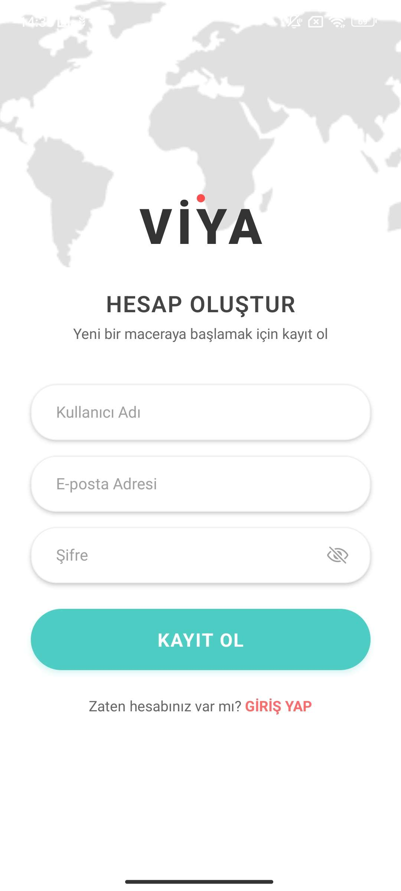

# VİYA - Mobil Seyahat Asistanı 🌍

VİYA, modern tasarımı ve güçlü backend altyapısı ile geliştirilmiş bir mobil uygulamadır. Bu proje, kullanıcıların güvenli bir şekilde hesap oluşturmasına ve seyahat planlarını yönetmesine olanak tanır.

## 📱 Ekranlar

### Giriş Yap (SignIn)

Kullanıcıların mevcut hesaplarıyla erişim sağladığı, sosyal medya entegrasyonuna hazır arayüz.

### Kayıt Ol (SignUp)

Yeni kullanıcıların kullanıcı adı, e-posta ve şifre ile hesap oluşturabildiği validasyonlu ekran.

## 📱 Ekran Görüntüleri

| Giriş Yap (SignIn)                                      | Kayıt Ol (SignUp)                                       |
| ------------------------------------------------------- | ------------------------------------------------------- |
|  |  |

1. Install dependencies

   ```bash
   npm install
   ```

2. Start the app

   ```bash
   npx expo start
   ```

Iapp/
├── (auth)/ # Giriş ve Kayıt sayfaları
├── (tabs)/ # Uygulama ana sekmeleri (Home vb.)
└── \_layout.tsx # Root Layout ve Auth koruması
src/
├── api/ # Axios client ve interceptor yapılandırması
└── assets/ # Görsel materyaller (Harita arka planı vb.)
